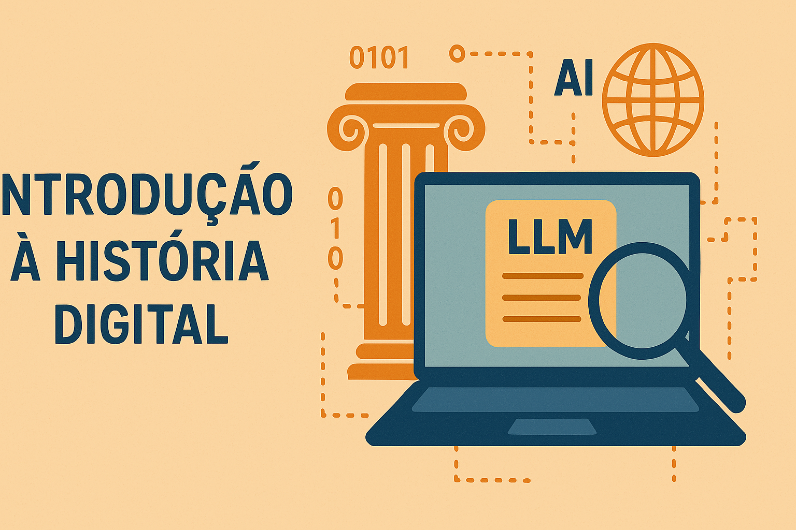
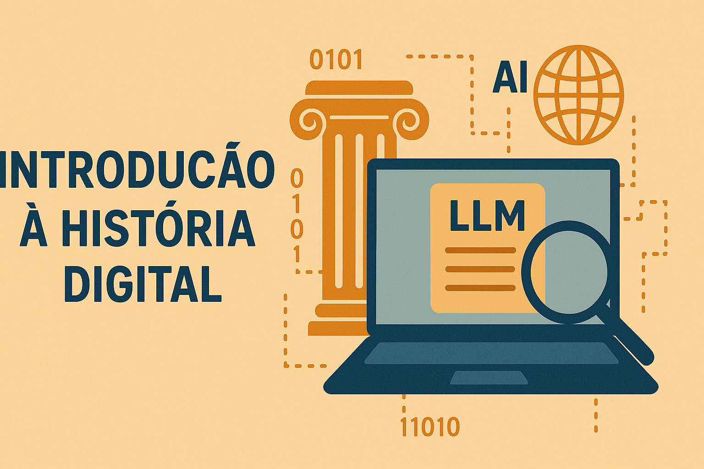
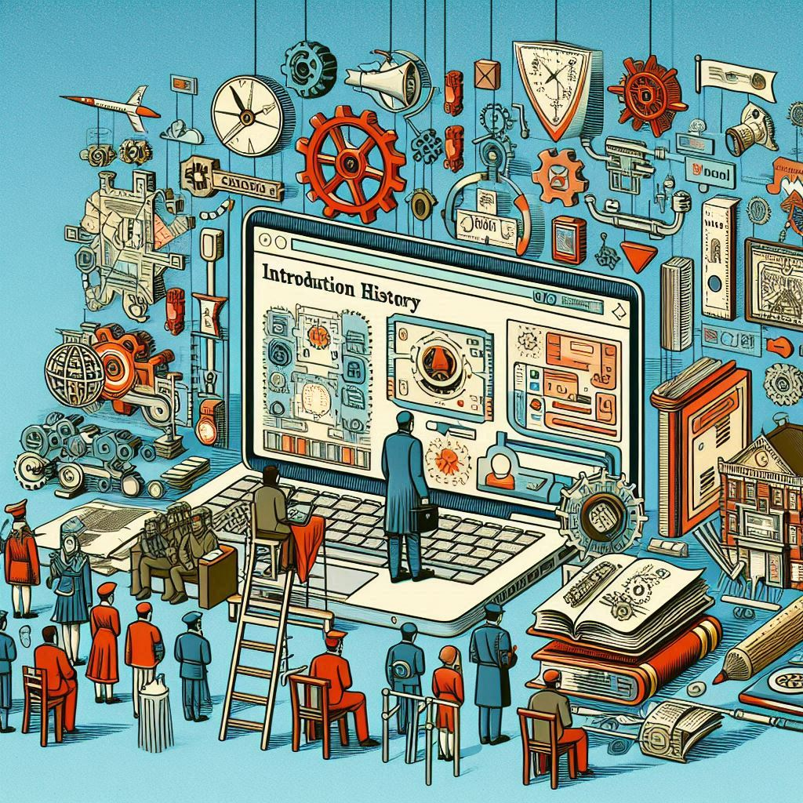
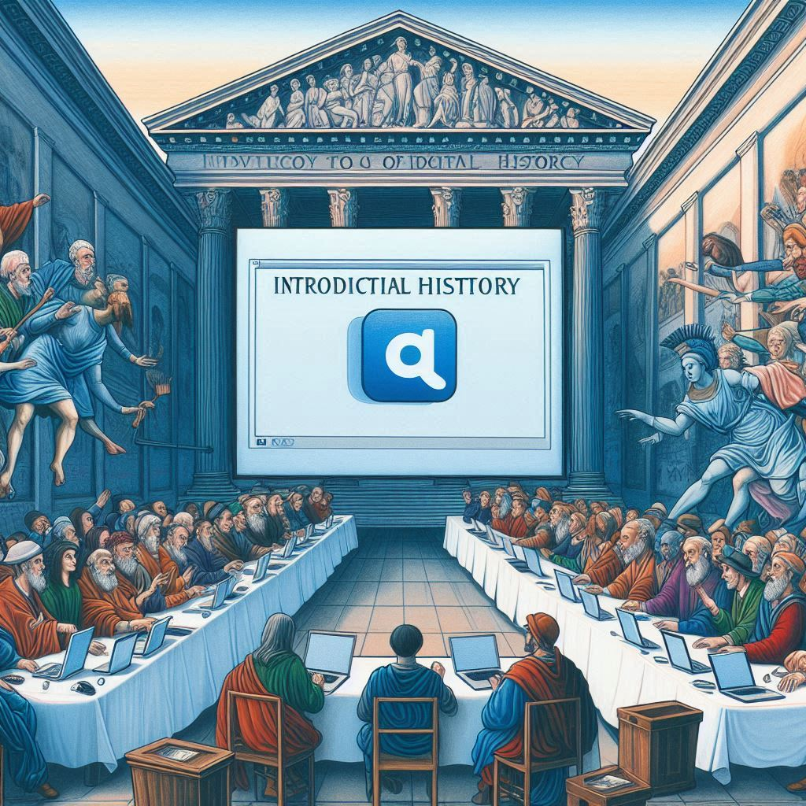

|Tipo | Tema | Pontos | Prazo |Observações|
|--------|----------------------|-----|------------|---------------------|
| Remota | IA e discplina de História Digital | 1,0 | 24/04/2025 | Atividade individual; entregar texto em sala |

# Introdução

Nesta atividade, vamos explorar como modelos de Inteligência Artificial Generativa representam visualmente a disciplina "Introdução à História Digital". Para isso, vamos utilizar dois modelos diferentes: ChatGPT 4o e Copilot (usando DALL-E 3).

A versão do ChatGPT 4o foi utilizado no plano plus da plataforma OpenAI, enquanto o Copilot foi utilizado na versão gratuita no navegador Microsoft Edge.

### Observações

Prompt é uma instrução que é forncecida pelo usuário para a IA. A partir do prompt, a IA gera uma resposta. No caso, o prompt é a instrução para criar uma imagem que represente a disciplina "História da América Independente".

O ChatGPT 4o é o modelo geral de IA atualmente, quue permite gerar imagens, textos e códigos. Existem outros modelos mais avançados, como o o1, o3-mini e o3-mini-high que são chamdaos de "reflexivos",. mas ainda não permitem a criação de imagens. Para mais informações, acesse o [site da OpenAI](https://openai.com/).

O Copilot é um modelo de IA desenvolvido pela OpenAI em parceria com a Microsoft. Ele é capaz de gerar código, textos e imagens a partir de prompts fornecidos pelo usuário. Ele está integrado ao Microsoft Edge. Para mais informações, acesse o [site da Microsoft](https://copilot.microsoft.com/).

# Atividade

Leia os prompts, analise as respostas e imagens geradas pelos modelos de IA e escreva um texto comentando as representações visuais criadas.

Busque identificar e discutir os seguintes elementos:

1. Quais elementos visuais foram utilizados para representar a disciplina?
2. Como esses elementos se relacionam com o conteúdo da disciplina?
3. Como as imagens representam a disciplina de forma geral?
4. Existem diferenças significativas entre as imagens geradas pelos dois modelos de IA e diferenças a partir dos prompts?

O texto final deve ter no máximo 500 palavras, utilizando espaçamento 1,5 e fonte de tamanho entre 12 e 14. 

---

## ChatGPT 4o

O prompt foi fornecido ao ChatGPT, com o modelo 4o selecionado, com usuário logado na conta plus da OpenAI.

### Prompt 1

"Crie uma figura colorida 16x9 que represente a disciplina INTRODUÇÃO À HISTÓRIA DIGITAL, componente optativo de um curso de graduação em História. A imagem será apresentada para os discentes para análise e reflexão."

#### Resposta

### Prompt 2

"agora leia a ementa da disciplina e refaça a imagem:

Ementa: O campo das humanidades digitais: definições, limites e possibilidades. Desenvolvimento histórico-cultural das tecnologias digitais de informação e comunicação (TDIC’s) e suas relações com a história. Documentos históricos como dados e objetos digitais: reflexões sobre a epistemologia da história. Desafios metodológicos e ferramentas digitais aplicadas à pesquisa e ao ensino. Acesso, coleta e organização de dados: repositórios, bibliotecas e hemerotecas digitais. Redes sociais, mídias digitais e perspectivas futuras para a pesquisa e o ensino de história. Reflexões críticas sobre raça, classe e gênero em sociedades digitais. LLMs (Modelos de Linguagem de Grande Escala) e IAs generativas na pesquisa e no ensino: usos, potencialidades, ética e riscos.
"

### Prompt 3

"em ambas as imagens a palavra INTRODUÇÃO aparece escrita errada como NTRODUÇÃO"

#### Resposta:

>Boa observação! A letra **"I"** de "INTRODUÇÃO" realmente está faltando nas duas imagens — ficou "NTRODUÇÃO". Isso compromete o uso direto da imagem para fins didáticos.
>
>Vou gerar uma nova versão corrigida agora, mantendo os elementos visuais já incorporados (como a coluna clássica, o notebook, os dados binários, e as referências a LLMs e IA), mas com o **título corretamente escrito como “INTRODUÇÃO À HISTÓRIA DIGITAL”**. Um instante.

---

## Copilot (usando DALL-E 3)

O prompt foi fornecido ao Copilot no navegador Microsoft Edge, com usuário logado na conta da Microsoft.

### Prompt 1

"Crie uma figura colorida 16x9 que represente a disciplina INTRODUÇÃO À HISTÓRIA DIGITAL, componente optativo de um curso de graduação em História. A imagem será apresentada para os discentes para análise e reflexão."

#### Resposta:

>A imagem solicitada está sendo gerada e estará disponível em breve. Espero que ela seja útil para a análise e reflexão dos discentes!

### Prompt 2

"agora leia a ementa da disciplina e refaça a imagem:

Ementa: O campo das humanidades digitais: definições, limites e possibilidades. Desenvolvimento histórico-cultural das tecnologias digitais de informação e comunicação (TDIC’s) e suas relações com a história. Documentos históricos como dados e objetos digitais: reflexões sobre a epistemologia da história. Desafios metodológicos e ferramentas digitais aplicadas à pesquisa e ao ensino. Acesso, coleta e organização de dados: repositórios, bibliotecas e hemerotecas digitais. Redes sociais, mídias digitais e perspectivas futuras para a pesquisa e o ensino de história. Reflexões críticas sobre raça, classe e gênero em sociedades digitais. LLMs (Modelos de Linguagem de Grande Escala) e IAs generativas na pesquisa e no ensino: usos, potencialidades, ética e riscos.
"

#### Resposta:

>Parece uma ementa rica e instigante! Vou gerar uma nova imagem, agora refletindo os aspectos destacados na ementa, como o papel das humanidades digitais, as TDIC's, questões de epistemologia e metodologias de pesquisa, além de reflexões críticas sobre raça, classe, gênero e o uso de IAs generativas. A nova imagem será exibida em breve!

